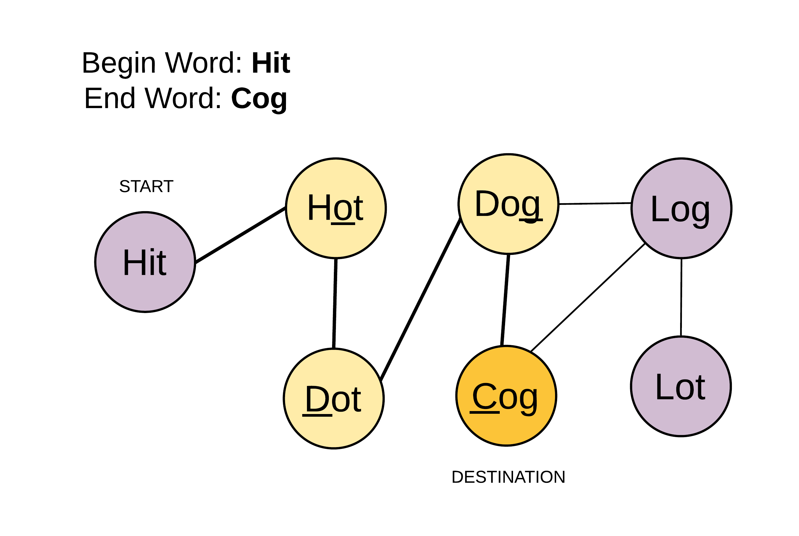

**目录**


# 第9课 | 深度优先搜索和广度优先搜索

## 知识点

---------待补充---------

## 实战题目

#### [433. 最小基因变化](https://leetcode-cn.com/problems/minimum-genetic-mutation/)

> 一条基因序列由一个带有8个字符的字符串表示，其中每个字符都属于 `"A"`, `"C"`, `"G"`, `"T"`中的任意一个。
>
> 假设我们要调查一个基因序列的变化。**一次**基因变化意味着这个基因序列中的**一个**字符发生了变化。
>
> 例如，基因序列由`"AACCGGTT"` 变化至 `"AACCGGTA" `即发生了一次基因变化。
>
> 与此同时，每一次基因变化的结果，都需要是一个合法的基因串，即该结果属于一个基因库。
>
> 现在给定3个参数 — start, end, bank，分别代表起始基因序列，目标基因序列及基因库，请找出能够使起始基因序列变化为目标基因序列所需的最少变化次数。如果无法实现目标变化，请返回 -1。
>
> **注意:**
>
> 1. 起始基因序列默认是合法的，但是它并不一定会出现在基因库中。
> 2. 所有的目标基因序列必须是合法的。
> 3. 假定起始基因序列与目标基因序列是不一样的。
>
> **示例 1:**
>
> ```
> start: "AACCGGTT"
> end:   "AACCGGTA"
> bank: ["AACCGGTA"]
> 返回值: 1
> ```
>
> **示例 2:**
>
> ```
> start: "AACCGGTT"
> end:   "AAACGGTA"
> bank: ["AACCGGTA", "AACCGCTA", "AAACGGTA"]
> 返回值: 2
> ```
>
> **示例 3:**
>
> ```
> start: "AAAAACCC"
> end:   "AACCCCCC"
> bank: ["AAAACCCC", "AAACCCCC", "AACCCCCC"]
> 返回值: 3
> ```

**解题思路**


**代码实现**

```c++
/*
注意：每一次基因变化的结果，都需要是一个合法的基因串，即该结果属于一个基因库。
*/
#include<queue>
#include<map>
using namespace std;
class Solution {
public:
    int minMutation(string start, string end, vector<string>& bank) {
      map<string, string> mymap;
      for(int i=0;i<bank.size();i++)
            mymap.insert(pair<string,string>(bank[i],bank[i]));
       //目标基因序列都不合法
      if(mymap.find(end) == mymap.end())
            return -1;
      char basic[] = {'A','C','G','T'};
      int nums = 0;
      queue<string> options;
      options.push(start);
      while(!options.empty()){
        //遍历所有备选基因串
        nums++;
        for(int k=options.size();k >0 ;k--) {
            string top = options.front();
            options.pop();
            //改变备选基因串的每一个字符，看是否与目标基因串相等或是否合法
            for(int i=0;i<top.length();i++) {
                char temp = top[i];
                for( int j = 0;j < 4 ;j++ ) {
                    top[i] = basic[j];
                    if(top == end)
                        return nums;
                    //是一个合法的基因串
                    if(   mymap.find(top) !=  mymap.end() ){
                        options.push(top);
                        mymap.erase(top);
                    }
                }
                top[i] = temp;
            }
        }
      }
     return -1;
    }
};
```


#### [127. 单词接龙](https://leetcode-cn.com/problems/word-ladder/)

> 给定两个单词（*beginWord* 和 *endWord*）和一个字典，找到从 *beginWord* 到 *endWord* 的最短转换序列的长度。转换需遵循如下规则：
>
> 1. 每次转换只能改变一个字母。
> 2. 转换过程中的中间单词必须是字典中的单词。
>
> **说明:**
>
> - 如果不存在这样的转换序列，返回 0。
> - 所有单词具有相同的长度。
> - 所有单词只由小写字母组成。
> - 字典中不存在重复的单词。
> - 你可以假设 *beginWord* 和 *endWord* 是非空的，且二者不相同。
>
> **示例 1:**
>
> ```
> 输入:
> beginWord = "hit",
> endWord = "cog",
> wordList = ["hot","dot","dog","lot","log","cog"]
> 
> 输出: 5
> 
> 解释: 一个最短转换序列是 "hit" -> "hot" -> "dot" -> "dog" -> "cog",
>      返回它的长度 5。
> ```
>
> **示例 2:**
>
> ```
> 输入:
> beginWord = "hit"
> endWord = "cog"
> wordList = ["hot","dot","dog","lot","log"]
> 
> 输出: 0
> 
> 解释: endWord "cog" 不在字典中，所以无法进行转换。
> ```

**解题思路 1 **(暴力，不推荐)

先做的  [433. 最小基因变化](https://leetcode-cn.com/problems/minimum-genetic-mutation/)  这题，所以乍一看，和这题感觉几乎一样，只不过是这题每次换要换26个字母，而不是那题原来的4个字母，只要测试用例不是很为难人。。。应该可以过吧，于是说干就干。。。

**代码实现 1**

```c++
/*
注意：每一次基因变化的结果，都需要是一个合法的基因串，即该结果属于一个基因库。
*/
#include<queue>
#include<map>
using namespace std;
class Solution {
public:
    int minMutation(string start, string end, vector<string>& bank) {
      map<string, string> mymap;
      for(int i=0;i<bank.size();i++)
            mymap.insert(pair<string,string>(bank[i],bank[i]));
       //目标基因序列都不合法
      if(mymap.find(end) == mymap.end())
            return -1;
      char basic[] = {'A','C','G','T'};
      int nums = 0;
      queue<string> options;
      options.push(start);
      while(!options.empty()){
        //遍历所有备选基因串
        nums++;
        for(int k=options.size();k >0 ;k--) {
            string top = options.front();
            options.pop();
            //改变备选基因串的每一个字符，看是否与目标基因串相等或是否合法
            for(int i=0;i<top.length();i++) {
                char temp = top[i];
                for( int j = 0;j < 4 ;j++ ) {
                    top[i] = basic[j];
                    if(top == end)
                        return nums;
                    //是一个合法的基因串
                    if(   mymap.find(top) !=  mymap.end() ){
                        options.push(top);
                        mymap.erase(top);
                    }
                }
                top[i] = temp;
            }
        }
      }
     return -1;
    }
};
```

**解题思路 2  (图)**

参考了 【[官方题解](https://leetcode-cn.com/problems/word-ladder/solution/dan-ci-jie-long-by-leetcode/)】，有了这个图就好说了



核心思想，把只相差一个字母的单词(包括start和字典中的所有单词)用线连在一起，就构成了一张图

那么要求从start到end的最小变换，就是求start到end的最短路径

当然这是一个无权图，还用不着迪杰斯特拉之类的最短路径算法。直接用层次遍历的方法，记录从start到end的层次即是最短路径。

**实现细节**

1.怎么知道两个单词只相差一个字母，怎么找到自己的下一个单词

2.如何记录层次也即最短序列长度

3.既然是图，怎样防止重复遍历到结点

**代码实现 2 **

```
class Solution {
public:
    int ladderLength(string beginWord, string endWord, vector<string>& wordList) {
        wordList.push_back(beginWord);
        map<string,vector<string>> wordMap;
        //标记该单词是否被访问过，防止出现环
        map<string,int> visited;
        //对所有单词预处理，以单词的通配符为hash的key，对应的value为具有这个通配符的形式的单词集合
        for(int i=0;i<wordList.size();i++){
            //初始化visited
            visited.insert(pair<string,int>(wordList[i],0));
             string tempWord = wordList[i];
            for(int j=0;j<tempWord.length();j++){
                char temp = tempWord[j];
                tempWord[j] = '*';
                wordMap[tempWord].push_back(wordList[i]);
                tempWord[j] = temp;
             }
        }
        queue<string> que;
        que.push(beginWord);
        int nums = 1;
        while(!que.empty()){
            nums++;
            //遍历每个备选单词
            for(int i = que.size();i >0;i--){
                 string top = que.front();
                 string oldTop = top;
                 que.pop();
                 //遍历每个单词的所有通配形式
                 for(int k=0;k<top.length();k++) {
                    char temp = top[k];
                    top[k] = '*';
                     //遍历每个单词与它只相差一个字母的所有单词
                    for(int j=0;j<wordMap[top].size();j++){
                        string word = wordMap[top][j];
                        if( word == endWord )
                            return nums;
                        if(word != oldTop && visited[word] == 0){
                            que.push(wordMap[top][j]);
                            visited[word] =1;
                        }
                    }
                    top[k] = temp;
            } 
         }
        }
        return 0;
    }
};
```

还可以优化的地方，map用hash


# 第10课 |  贪心算法

## 知识点

---------待补充---------

## 实战题目

#### [860. 柠檬水找零](https://leetcode-cn.com/problems/lemonade-change/)

> 在柠檬水摊上，每一杯柠檬水的售价为 `5` 美元。
>
> 顾客排队购买你的产品，（按账单 `bills` 支付的顺序）一次购买一杯。
>
> 每位顾客只买一杯柠檬水，然后向你付 `5` 美元、`10` 美元或 `20` 美元。你必须给每个顾客正确找零，也就是说净交易是每位顾客向你支付 `5` 美元。
>
> 注意，一开始你手头没有任何零钱。
>
> 如果你能给每位顾客正确找零，返回 `true` ，否则返回 `false` 。
>
> **示例 1：**
>
> ```
> 输入：[5,5,5,10,20]
> 输出：true
> 解释：
> 前 3 位顾客那里，我们按顺序收取 3 张 5 美元的钞票。
> 第 4 位顾客那里，我们收取一张 10 美元的钞票，并返还 5 美元。
> 第 5 位顾客那里，我们找还一张 10 美元的钞票和一张 5 美元的钞票。
> 由于所有客户都得到了正确的找零，所以我们输出 true。
> ```
>
> **示例 2：**
>
> ```
> 输入：[5,5,10]
> 输出：true
> ```
>
> **示例 3：**
>
> ```
> 输入：[10,10]
> 输出：false
> ```
>
> **示例 4：**
>
> ```
> 输入：[5,5,10,10,20]
> 输出：false
> 解释：
> 前 2 位顾客那里，我们按顺序收取 2 张 5 美元的钞票。
> 对于接下来的 2 位顾客，我们收取一张 10 美元的钞票，然后返还 5 美元。
> 对于最后一位顾客，我们无法退回 15 美元，因为我们现在只有两张 10 美元的钞票。
> 由于不是每位顾客都得到了正确的找零，所以答案是 false。
> ```
>
> **提示：**
>
> - `0 <= bills.length <= 10000`
> - `bills[i]` 不是 `5` 就是 `10` 或是 `20` 

**解题思路**

1.用三个变量分别存一下我当前有多少张5元的，多少张10元的，多少找20元的

2.给顾客找零时，优先退还面额最大的，没有再退面额小的 。                                                             

如：顾客给20元，那么需要找零15元。如果我10元和5元的零钱都有，那么就先退一张10元和一张5元；如果没有10元，但是有3张以上的5元，那么就退给顾客3张5元；否则有顾客不能正确找零，返回false

3.注意更新当前每种面额的数目

**代码实现**

```c++
#include<map>
#include<utility>
class Solution {
public:
    bool lemonadeChange(vector<int>& bills) {
        int mycash5 = 0;
        int mycash10 = 0;
        int mycash20 = 0;
        int billsLen = bills.size();
        for( int i = 0; i < billsLen ; i++) {
            if ( bills[i] == 5){
                 mycash5++; 
            }else if(bills[i] == 10 ){
                if( mycash5 == 0)
                    return false;
                else{
                    mycash5--;
                    mycash10++;
                }
            }else{
                if( mycash10 != 0 && mycash5 != 0) {//至少一张10元和一张5元
                    mycash10--;
                    mycash5--;
                }else if (mycash5 > 2 ) {//至少有3张5元
                    mycash5 -= 3;
                }else
                    return false;
                mycash20++;
            }
        }
        return true;
    }
};
```


#### [515. 在每个树行中找最大值](https://leetcode-cn.com/problems/find-largest-value-in-each-tree-row/)

> 您需要在二叉树的每一行中找到最大的值。
>
> **示例：**
>
> ```
> 输入: 
> 
>           1
>          / \
>         3   2
>        / \   \  
>       5   3   9 
> 
> 输出: [1, 3, 9]
> ```

**解题思路**

和  [102. 二叉树的层序遍历](https://leetcode-cn.com/problems/binary-tree-level-order-traversal/)   以及 [429. N叉树的层序遍历](https://leetcode-cn.com/problems/n-ary-tree-level-order-traversal/) 的思想、代码基本一样，不同的是，这里记录的是每层的最大值。遍历每层时，依次与当前层最大值比较即可

**代码实现**

```c++
/**
 * Definition for a binary tree node.
 * struct TreeNode {
 *     int val;
 *     TreeNode *left;
 *     TreeNode *right;
 *     TreeNode(int x) : val(x), left(NULL), right(NULL) {}
 * };
 */
#include<queue>
class Solution {
public:
    vector<int> largestValues(TreeNode* root) {
        queue<TreeNode*> treeQueue;
        vector<int> res;
        if(root == NULL)
            return res;
        treeQueue.push(root);
        while(!treeQueue.empty()) {
            int maxVal = INT_MIN;//每一层都要重置maxVal
            for(int i = treeQueue.size();i > 0;i--) {
                TreeNode* top = treeQueue.front();
                treeQueue.pop();
                if( top->left )
                    treeQueue.push(top->left);
                if( top->right )
                    treeQueue.push(top->right);
                maxVal = top->val > maxVal ? top->val : maxVal;
            }
            res.push_back(maxVal);
        }
        return res;
    }
};
```


# 第11课 | 二分查找

## 知识点

---------待补充---------

## 实战题目